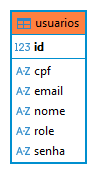

# CRUD_CADASTRO_DE_PESSOAL_CLEAN_ARCH_HEXAGONAL

## Requisitos:
- apache-maven-3.9.9 - [Download](https://maven.apache.org/download.cgi)
- Java 17 - [Download](https://www.oracle.com/java/technologies/javase/jdk17-archive-downloads.html)
- FrameWork - Spring Boot 4.0.3
- Docker Desktop (Rancher Desktop) - o banco foi configurado em um docker-compose. yml
- Comandos basicos de docker - [Link](https://github.com/lucasscardoso/Docker)
-  você pode alterar o application.properties para utilizar o banco de sua escolha,originalmente ele está configurado para utilizar o PostgreSql 18 em uma imagem baseada no Alpine Linux.

### Esse CRUD foi desenvolvido utilizando conceitos de Clean Architecture onde explorei as melhores formas de aplicar esse pattern.

## Core

- core/user/model: Interface de Usuario (regras de negócio puras).
- core/user/service: Casos de Uso (AlterarUser, BuscaCompleta, BuscaUser, CreateUser, DeletaUser).
- core/user/repository: Interface de Repositorio (Regras para funcionamento do repository.).
- core/shared: Tudo que é compartilhado no core,exceptions,PasswordEncoder(Interace para criptografia) , records,useCase(Interface para padronizar as services com entradas e saidas),userDto(dtos personalizados para as services).
- core/user/User.java: Classe padrão com os atributos para a criação de um Usuario.

## External
- externals/auth/cryptograia: Implementações de PasswordEncoder do core (Realiza a criptografia da senha utilizando bcrypt, optei dessa forma para que meu core nao dependa de dependencias externas).

- externals/auth/dto: Dto para passar somente o Token na resposta da autenticação.
- externals/auth/jwt/TokenService.java: Criação e validação do token.
- externals/auth/service: Possui implementacao da UserDetailsService,Essa classe é a ponte de comunicação entre o banco de dados e o Spring Security.
- externals/controllers: AlterarUserController,AutenticacaoController,BuscarUserController,BuscarCompletaUserController,CreateUserController,DeletarUserController.
- externals/db/relationalAdapter: possui a classe onde os metodos de persistencia funcionam, ela implementa a interface UserRepository do core.
- externals/db/repository: Interface que implenta o JPA.
- externals/entity: classe espelho da User.java do core, onde relacionamos a tabela, colunas.
- externals/security: possui a securityConfig,onde e são feitos os filtros e validações da aplicação, juntamente com o SecurityFilter onde extende OncePerRequestFilter, criando nossos metodos personalizados de validação.

### Esquema relacional da tabela:
### Caso você não queira utilizar via docker-compose,segue codigo para criação da tabela.
<details>
  <summary>Clique para ver o SQL de criação da tabela</summary>

  ```sql
 CREATE TABLE public.usuarios (
	id int8 GENERATED BY DEFAULT AS IDENTITY( INCREMENT BY 1 MINVALUE 1 MAXVALUE 9223372036854775807 START 1 CACHE 1 NO CYCLE) NOT NULL,
	cpf varchar(11) NOT NULL,
	email varchar(255) NOT NULL,
	nome varchar(255) NOT NULL,
	"role" varchar(255) NOT NULL,
	senha varchar(255) NOT NULL,
	CONSTRAINT uk2et2smpfrtsohr7w9fe1v8a5e UNIQUE (cpf),
	CONSTRAINT usuarios_pkey PRIMARY KEY (id),
	CONSTRAINT usuarios_role_check CHECK (((role)::text = ANY ((ARRAY['ADMIN'::character varying, 'CLIENTE'::character varying])::text[])))
);
````
</details>

